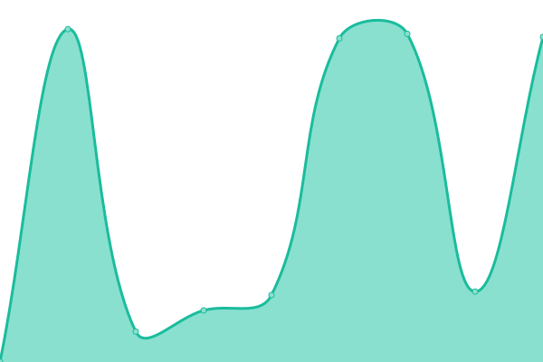
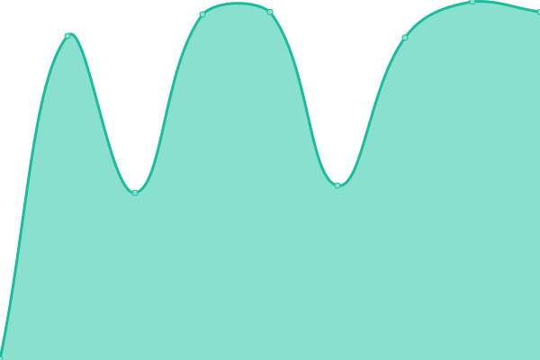

# [📈 Live Status](https://Tisfeng.github.io/uptime): <!--live status--> **🟩 All systems operational**

This repository contains the open-source uptime monitor and status page for [Tisfeng](https://Tisfeng.github.io/uptime), powered by [Upptime](https://github.com/upptime/upptime).

With [Upptime](https://upptime.js.org), you can get your own unlimited and free uptime monitor and status page, powered entirely by a GitHub repository. We use [Issues](https://github.com/Tisfeng/Upptime/issues) as incident reports, [Actions](https://github.com/Tisfeng/Upptime/actions) as uptime monitors, and [Pages](https://Tisfeng.github.io/Upptime) for the status page.

<!--start: status pages-->
<!-- This summary is generated by Upptime (https://github.com/upptime/upptime) -->
<!-- Do not edit this manually, your changes will be overwritten -->
<!-- prettier-ignore -->
| URL | Status | History | Response Time | Uptime |
| --- | ------ | ------- | ------------- | ------ |
|  [DeepLX](https://deeplx.izual.me) | 🟩 Up | [deep-lx.yml](https://github.com/tisfeng/uptime/commits/HEAD/history/deep-lx.yml) | 

 146ms
     
 | 

<a href="https://uptime.izual.me/history/deep-lx">100.00%</a>
    

|  [Ollama](https://ollama.izual.me) | 🟩 Up | [ollama.yml](https://github.com/tisfeng/uptime/commits/HEAD/history/ollama.yml) | 

 439ms
     
 | 

<a href="https://uptime.izual.me/history/ollama">100.00%</a>
    

|  [LobeChat](https://chat.izual.me) | 🟩 Up | [lobe-chat.yml](https://github.com/tisfeng/uptime/commits/HEAD/history/lobe-chat.yml) | 

 764ms
     
 | 

<a href="https://uptime.izual.me/history/lobe-chat">100.00%</a>
    

|  [Inpaint](https://inpaint.izual.me) | 🟩 Up | [inpaint.yml](https://github.com/tisfeng/uptime/commits/HEAD/history/inpaint.yml) | 

 458ms
     
 | 

<a href="https://uptime.izual.me/history/inpaint">100.00%</a>
    

|  [cf-image-hosting](https://image.izual.me) | 🟩 Up | [cf-image-hosting.yml](https://github.com/tisfeng/uptime/commits/HEAD/history/cf-image-hosting.yml) | 

 185ms
     
 | 

<a href="https://uptime.izual.me/history/cf-image-hosting">100.00%</a>
    

|  [short-link](https://s.izual.me) | 🟩 Up | [short-link.yml](https://github.com/tisfeng/uptime/commits/HEAD/history/short-link.yml) | 

 149ms
     
 | 

<a href="https://uptime.izual.me/history/short-link">100.00%</a>
    

|  [ipcheck](https://ipcheck.izual.me) | 🟩 Up | [ipcheck.yml](https://github.com/tisfeng/uptime/commits/HEAD/history/ipcheck.yml) | 

 91ms
     
 | 

<a href="https://uptime.izual.me/history/ipcheck">100.00%</a>
    

|  [Quick Reference](https://ref.izual.me) | 🟩 Up | [quick-reference.yml](https://github.com/tisfeng/uptime/commits/HEAD/history/quick-reference.yml) | 

 134ms
     
 | 

<a href="https://uptime.izual.me/history/quick-reference">100.00%</a>
    

<!--end: status pages-->

[**Visit our status website →**](https://Tisfeng.github.io/Upptime)

## 📄 License

- Powered by: [Upptime](https://github.com/upptime/upptime)
- Code: [MIT](./LICENSE) © [Tisfeng](https://Tisfeng.github.io/Upptime)
- Data in the `./history` directory: [Open Database License](https://opendatacommons.org/licenses/odbl/1-0/)
